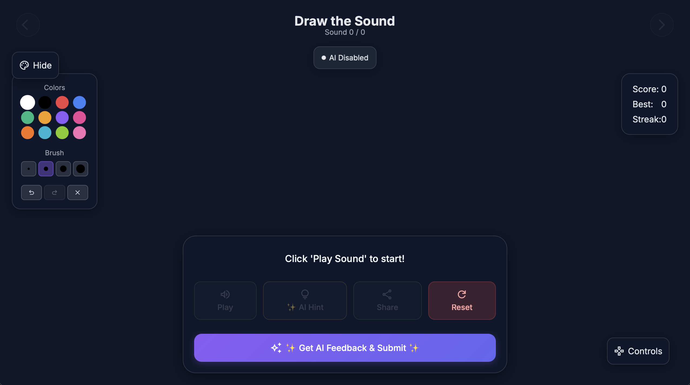
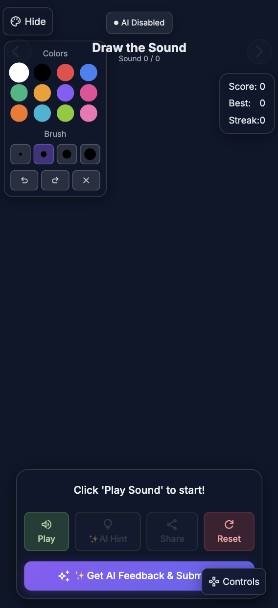

# Sound Sketch - Draw the Sound Game

An interactive web game where you listen to sounds and draw what you hear on a **fullscreen canvas**, powered by AI for intelligent feedback. Discover and draw from a diverse collection of sounds!

## Screenshots

### Desktop Experience

*Fullscreen canvas with collapsible tools and controls for immersive drawing*

### Mobile Experience  

*Touch-optimized interface with responsive design*

## Key Features

### **Fullscreen Drawing Experience**
- **Immersive Canvas**: Full viewport drawing area for maximum creativity
- **Collapsible UI**: Hide drawing tools and game controls for distraction-free drawing
- **Advanced Tools**: Multiple colors, various brush sizes, undo/redo, clear canvas
- **Responsive Design**: Optimized for mobile, tablet, and desktop with touch support

### **Diverse Sound Library**
- **4 Categories**: Nature, Animals, Music, and Everyday sounds
- **26 Unique Sounds**: Carefully curated audio challenges to spark your creativity
- **High-Quality Audio**: Crystal clear sounds for the best drawing inspiration
- **Progressive Discovery**: Unlock your artistic interpretation of each sound

### **AI-Powered Analysis (Optional)**
- **Smart Scoring**: Accuracy (40%), Creativity (30%), Detail (30%)
- **Intelligent Feedback**: Detailed analysis with improvement suggestions
- **Context-Aware Hints**: AI-generated hints based on expected visual elements
- **Works Without AI**: Full functionality even without API key

### **Progress & Sharing**
- **Local Storage**: Saves last 50 drawings, scores, and progress
- **Share & Export**: Native sharing API or download as PNG
- **Real-time Scoring**: Current score, best score, streak tracking

## Quick Start

1. **Clone & Open**:
   ```bash
   git clone https://github.com/kikugo/sound-sketch.git
   cd sound-sketch
   ```
   Open `app.html` in any modern browser - works immediately!

2. **Enable AI** (Optional):
   - Get free API key from [Google AI Studio](https://aistudio.google.com/app/apikey)
   - Enter when prompted or click "AI Status" indicator later

## How to Play

1. **Select Category** → **Play Sound** → **Draw Your Interpretation**
2. **Toggle UI**: Hide/show tools (palette icon) and controls (gamepad icon)
3. **Get AI Hints** → **Submit for Analysis** → **Share Your Art**

## Technical Stack

- **Frontend**: HTML5, CSS3, JavaScript (single file)
- **Audio**: Tone.js for sound playback
- **Styling**: Tailwind CSS with responsive design
- **AI**: Google Gemini 2.5 Flash (optional)
- **Storage**: LocalStorage for persistence

## Browser Support

Chrome, Firefox, Safari, Edge | Mobile & Desktop Optimized

## Contributing

Feel free to add new sounds, improve AI prompts, enhance UI/UX, or report bugs!

## Credits

- **Sounds**: Freesound.org (CC0 License)
- **AI**: Google Gemini 2.5 Flash  
- **Icons**: Google Material Symbols

---

**Start drawing sounds and discover what inspires you!** 